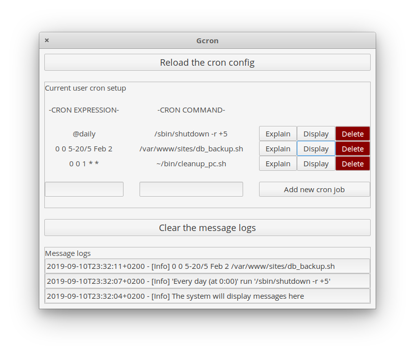

[](https://travis-ci.org/padjis/gcron)

<p align="center">
    
</p>

<h1 align="center">Gcron</h1>
<p align="center">Handle your cron configuration</p>

<p align="center">
  <a href="https://appcenter.elementary.io/com.github.padjis.gcron"></a>
</p>

<p align="center">
    
</p>


## How does it work

- Gcron reads your cron configuration at startup and initializes its content based on it
- The user can display a cron input or explain it to get a better understanding
- The user can as well add a cron line to its cron configuration

## Built for elementary OS

While Gcron will be compiling on any Linux distribution, it is primarily
built for [elementary OS].

[][AppCenter]


## Developing and building

Development is targeted at [elementary OS] Juno. If you want to hack on and
build Badger yourself, you'll need the following dependencies:

* libgranite-dev
* libgtk-3-dev
* meson
* valac

You can install them on elementary OS Juno with:

```shell
sudo apt install elementary-sdk
```

Run `meson build` to configure the build environment and run `ninja install`
to install:

```shell
meson build --prefix=/usr
cd build
sudo ninja install
```

Then run it with:

```shell
com.github.padjis.gcron
```

[elementary OS]: https://elementary.io
[AppCenter]: https://appcenter.elementary.io/com.github.padjis.gcron